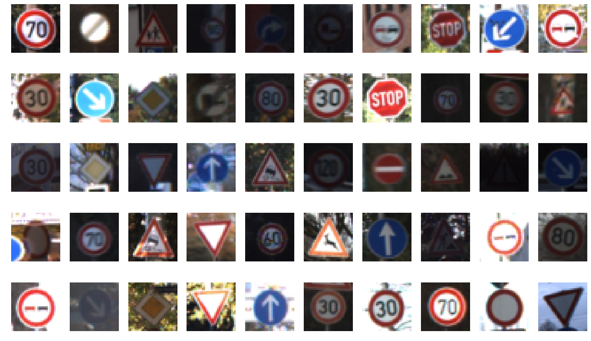
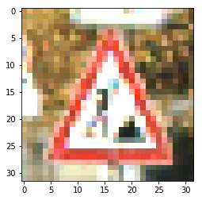
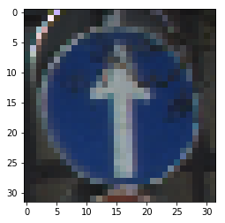
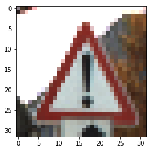

#**Traffic Sign Recognition Writeup**

**Build a Traffic Sign Recognition Project**

The goals / steps of this project are the following:
* Load the data set (see below for links to the project data set)
* Explore, summarize and visualize the data set
* Design, train and test a model architecture
* Use the model to make predictions on new images
* Analyze the softmax probabilities of the new images
* Summarize the results with a written report

## Files submitted
The following repository contains all the required files to review the submission
including HTML version of the notebook.

The results [can be viewed here](http://htmlpreview.github.io/?https://github.com/mateuszmrozewski/CarND-Traffic-Sign-Classifier-Project/blob/master/Traffic_Sign_Classifier.html)

## Dataset Exploration

### Dataset Summary
Dataset can be summarized in the following manner:
```
Number of training examples = 34799
Number of validation examples = 4410
Number of testing examples = 12630
Image data shape = (32, 32, 3)
Number of classes = 43
```

### Exploratory visualization
For the visualization part I have displayed a histogram of classes:


This is useful to see that not all of the classes have the same number training examples. It may
affect our predictions. For certain types of images.

Another visualization I did to display 50 random images. It is good to see some examples to get the idea
how to actual input looks like to see that some are darker, some are lighter, some were upsampled and some
were downsampled. You can see that images vary in quality which may affect the training process.



## Design and Test Model Architeture

### Preprocessing
As data preprocessing I only transformed the images into grayscale and normalized the images.

Normalizing data allows us to get better area of potential learning errors which affects the way network
is learning. Not normalized data would produce error that make it harder for the network to converge.

Grayscaling allows us to reduce the number of input parameters for the network by the factor of three. 
In most cases we can get enough information just from the shape of sign and brightness/contract. Color
is mostly useful for people to quickly recognize the signs.

### Model architecture
My model has the following architecture:

| Layer  | Description   |
| -------| ------------- |
| Input  | 32x32x1 Grayscale image |
| Convolution 5x5 | 1x1 stride, valid padding, output 28x28x20 |
| RELU | |
| Max pooling | 2x2 stride, output 14x14x20 |
| Convolution 3x3 | 1x1 stride, valid padding, output 12x12x40 |
| RELU | |
| Convolution 3x3 | 1x1 stride, valida padding, output 10x10x80 | 
| RELU | |
| Max pooling | 2x2 stride, output 5x5x80 |
| Fully connected | 2000 inputs to 120 outputs |
| RELU |
| Output layer | 120 inputs, 43 outputs |


### Model training
I have used AdamOptimizer. Before changing the model (additional convolutional layer) I was experimenting 
with learning rate from 0.0001 to 0.001, epochs around 40 to 50 and batch sizes 64 and 128.

After adding the additional layer I bumped the learning rate up to 0.0008 and I was able to reduce number
of epochs to 20, as the model converged much quicker. 

### Solution approach
Initially I have started with with the LeNet solution from the laboratory exercise.
It gave reasonable starting results. However to get more accurate results it 
required several changes.

The initial shape of the network was:
* two convolutional layers with 5x5 filters and depth of 10 and 20 respectively
* these layers were followed by relu activation and max pooling
* after that we had two fully connected layers and output layer

As the first step I have removed one of the fully connected layers as it seemed 
it is not needed to generalize from the convolutions to classes (although some of 
the best architectures for image recognition have two hidden dense layers).

As the next step I started to play around with the filter size and depth of the
convolutions. I discovered that making them deeper allowed to improve the accuracy.
My understanding is that deeper convolution allow to catch more details from a single
frame that the filter is looking at. Following that lead I have added one more 
convolutional layer even deeper than the previous ones which bumped the accuracy
by around 2%.

Later it was just trail-and-error approach with different filter sizes, depth of 
the convolutions and hyperparameters.

I went with ReLU as activation from the very beginning and didn't try any other
function.

I got rid of max pooling from one of the convolutional layers as the network
started to underfit (the middle convolution does not have max pooling).


## Test a Model on New Images
I have tested the model on 10 first images from the downloaded dataset.

Some of the images had to be upsampled to match the size. So they quality 
was very low:


Some of them show some additional noise or dirt:


And some of them have interesting background that could make the classification
harder:


The accuracy of predictions for the first 10 images is 100%. This seems to be in 
order with the test accuracy. Even though the sample images expose interesting
features like noise, low quality or various backgrounds they are still fairly
easy to categorize. This leads me to thinking that the quality of the image 
must be really poor to make the correct predictions.
 
The accuracy of captured images is 100% while it was 94.8% on the testing
 set thus is seems the model is overfitting.
 
The top 5 softmax probabilities also show very high confidence in the predictions
leading to the confirmation of the fact that model might be overfitting.
 
## Final thoughts
This project was an interesting follow up to the Deep Learning Nanodegree. I got a chance to practice more
what I have learnt previously. I know that I could push it further by trying to augment the training dataset
with additional variations of the images. However I was very satisfied with getting such a good result
with such a simple model.